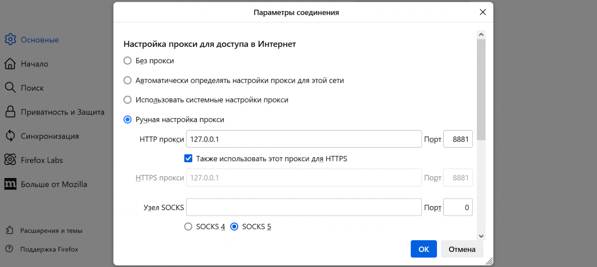

# No DPI

Alternatives: [zapret](https://github.com/bol-van/zapret)

Pros and Cons of No DPI in comparison with Zapret:

pros:
- Doesn't break other sites (at least for me)
- Just a Python script. Not a Linux Service.
- Easier to set up

cons:
- Works only for youtube
- You need to change the proxy configuration in the browser

## How to use

Requires: Python >= 3.8

1) Download files: blacklist.txt, nodpi.py or nodpi.
2) `chmod +x` nodpi.
3) Insert your global path to blacklist.txt in the blacklistpath variable.
5) Configure browser to use proxy on 127.0.0.1:8881
6) Add the path to nodpi into your ENV.
7) run `nodpi`

## Known Bugs

- Doesn't bypass IP block
- Only TCP
- Doesn't work for HTTP only
- Not working with sites with old TLS
